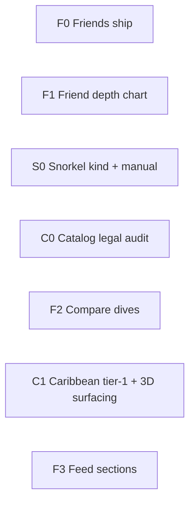

# GoDive product differentiation plan

Strategic plan to **polish three differentiators** (catalog, friends, snorkel) while keeping everything else **good enough** for market entry. Grounded in the current architecture: **CloudKit** dive log (source of truth), **Firebase** social directory + friends + friend-visible projections, Caribbean-leaning catalog pipeline, **RealityKit** Field Guide heroes.

Related docs: **`hybrid_cloud_sync_boundaries.md`**, **`docs/friends.md`**, **`docs/acknowledgments.md`**, **`app_summary.md`**.

---

## Positioning: win on three, good enough on the rest

| **Differentiate (polish + ship)** | **Good enough (maintain, don’t over-invest)** |
|-----------------------------------|-----------------------------------------------|
| Field Guide + 3D + snorkel-first ID story | Global species coverage race |
| Friends + shared dives + buddy / same-outing UX | Public search, DMs, clubs, leaderboards |
| Snorkel / surface activities as first-class log | Full freedive computer parity, tech/cave tooling |
| Dive log import + charts + gear (core product) | Trip planner depth, social graph beyond friends |

Competitors often look stronger on **data coverage** because they aggregate open taxonomies (FishBase, SeaLifeBase, WoRMS, REEF checklists, crowd-sourced photos) across **more regions**. GoDive already documents a similar stack in **`docs/acknowledgments.md`** (FishBase, SeaLifeBase, REEF TWA filter, Wikimedia, _Caribbean Reef Life_ as authoring cross-reference, snorkelstj.com for name validation). The gap is less “no sources” and more **pipeline breadth + licensed narrative/media + UX that shows why the catalog feels special (3D, snorkel angle)**.

---

## 1. Catalog — content, legal, coverage, 3D

### Current assets

- Build pipeline + CDN refresh; REEF used to **filter** toward diver-relevant Tropical Western Atlantic fish.
- **3D:** bundled USDZ + optional Storage; interactive heroes in Field Guide (`FieldGuideMarineLifeRealityHeroView`); dive media overlays prefer **photo over 3D** today.
- **Copy/images:** mix of Wikimedia (per-file CC) and book cross-reference — not the same as **licensed CRL/REEF field-guide text and art**.

### Strategic choice (pick one primary path; can blend)

**Path A — Publisher partnership (best for App Store story + legal clarity)**

- Targets: **REEF** (citizen science + education), **Caribbean Reef Life / Mickey Charteris** (already credited in acknowledgments), or a regional publisher for Indo-Pacific later.
- Ask for: non-exclusive **in-app ID thumbnails**, species blurbs, or co-marketing (“powered by REEF”) in exchange for attribution, optional REEF survey export later, or affiliate.
- Deliverable: signed **content license addendum** (what text/images, regions, update cadence, takedown).

**Path B — Open-data + original voice (faster, no deal)**

- Expand **automated** ingestion (partly in repo today): FishBase/SeaLifeBase facts → **GoDive-written** natural-history paragraphs (human-edited or templated + editor pass); never paste copyrighted book prose.
- Images: Wikimedia + original photos/illustrations + commissioned art for flagship species; 3D as **hero** where photo is weak.
- Region strategy: **own Caribbean + snorkel-shallow species** deeply rather than matching worldwide counts.

**Path C — Competitor source audit (research, ~1–2 days)**

- For each rival app, document: data license page, species API vs offline bundle, image attribution, regions shipped.
- Common open layers: FishBase, WoRMS, GBIF, iNaturalist (API terms differ), REEF, regional checklists.
- Outcome: **repeatable ingest spec** (“add region X by joining checklist Y + FishBase join + our copy layer”) — not copying a competitor’s proprietary DB.

### 3D as differentiator (product, not only more models)

- **Field Guide:** default to 3D on flagship species where models exist; image as secondary tap (toggle logic already exists).
- **Dive log:** species tags / sightings sheet → **3D peek** when no user photo.
- **Friends / shared dives:** marine-life section thumbnails from catalog 3D or image (read-only).
- **Explore / Home:** small “species of the week” with 3D hero (low engineering, high marketing fit).

### Catalog phases

| Phase | Goal | Output |
|-------|------|--------|
| **C0 — Legal hygiene** | No ambiguous book copy in bundle | Audit catalog strings vs CRL; replace or shorten; acknowledgments + in-app “About catalog” |
| **C1 — Depth in one region** | Beat rivals on *experience* in Caribbean snorkel + dive | 200–400 “tier 1” species: original copy, verified image or 3D, snorkel depth note |
| **C2 — Pipeline** | Close coverage gap without one-off manual work | Scripted checklist import (REEF TWA + filters), QA report like snorkelstj validator |
| **C3 — Partnership or CDN** | Step-change credibility | Signed REEF/CRL assets OR public “REEF volunteer” integration roadmap |

**Good enough:** Indo-Pacific breadth, fish-ID ML accuracy wars, photo for every invertebrate.

---

## 2. Friends — finish infrastructure + “same outing” story

### Already in place

- Invites (QR, `links.godiveios.com`), friendships, **`users/{uid}/sharedDives`** projections (including compressed profile track), notes/media opt-in.
- Buddy link + tag on dives; **Logbook → Buddy Feed**; friend shared logbook/detail; debounced re-publish on local dive edits.
- See **`docs/friends.md`**, **`GoDiveSharedDiveProjectionMapping`**, change log **§119**.

### Gaps that block differentiation

1. **Friend detail ≠ your dive detail**  
   `FriendSharedDiveDetailView` is a flat scroll (stats, tags, buddies, media) — **no depth chart** even though projections include `profileTrackData`. Largest perceived gap vs “compare with buddy.”

2. **No “same dive” model**  
   Tagging a friend on *your* dive and viewing *their* shared dive are separate projections. Users expect: “We dove together → compare depth / air / time.”

   Product rules (no CloudKit co-edit required):

   - **V1 heuristic:** same friend, start times within ±N hours, site names fuzzy-match OR mutual tags → offer **Compare**.
   - **V2 explicit:** “Link to friend’s dive” picker (friend must have shared that dive).
   - **V3 (later):** shared `outings/{id}` stub in Firestore — only if V1/V2 feel brittle.

3. **Buddy feed product definition**  
   Today: merged chronological friend projections (solid MVP). Decide and document:

   - **Scope:** only friends’ **shared** dives vs also “friend tagged you” highlights.
   - **Ranking:** newest-first vs sections (“Tagged you”, “Same site as your last dive”).
   - **Actions:** open compare, open species; defer reactions/likes.
   - **Reliability:** Firebase soft-fail → retry; offline cache = good enough later.

4. **Infrastructure “done” checklist (ship bar)**

   - Universal Links + invite domain deployed; preferred HTTPS invite URL stable.
   - Unfriend / delete account / stop sharing → projections removed (verify end-to-end).
   - Settings copy matches behavior (default share on; notes/media off by default).
   - Push on invite accepted (implemented); broader “friend shared a dive” push = good enough to defer.

### Friends phases

| Phase | Goal | Key deliverables |
|-------|------|------------------|
| **F0 — Ship core** | Reliable connect + view | Rules/hosting; polish invite UX; dogfood two accounts |
| **F1 — Parity read** | Friend dive feels like a dive | Depth chart + tank/SAC when in projection; reuse read-only chart components |
| **F2 — Together** | Differentiator | “Tagged you” → **Compare with my dive** (picker or heuristic); overlaid or side-by-side depth; SAC if both shared |
| **F3 — Feed v2** | Habit | Sections: **With you**, **Recent**, **New sightings**; pull-to-refresh; incremental fetch (realtime optional) |

**Compare UX (V1):** From your dive overview, if a tagged buddy is a GoDive friend with an overlapping shared dive, show **Compare** → dual charts (local track vs friend projection), aligned on time or depth index.

**Good enough:** Comments, likes, global feed, non-friend discovery.

---

## 3. Snorkel — close the onboarding promise

### Current state

- Onboarding captures **`doesSnorkeling`** and markets “track snorkeling activities.”
- **`DiveActivity`** is scuba-shaped: dive #, tank, SAC, deep profiles from FIT/UDDF.
- **Logbook add hub** includes **New Snorkel Activity** (placeholder upload path); no full **`activityKind`** model yet.

### Recommended product model

Introduce **`ActivityKind`** on `DiveActivity` (single model is simpler for logbook/home stats than a parallel entity):

| Kind | Import | Profile chart | Dive # | Tank / gas | Primary UX |
|------|--------|---------------|--------|------------|------------|
| **Scuba** | FIT/UDDF | Yes | Yes | Yes | Today |
| **Snorkel** | Manual (+ future watch) | Optional shallow / none | No (or separate “snorkel #”) | Hidden | Site, duration, sightings, photos, conditions |
| **Freedive** | Later | Yes | Optional | Minimal | Defer deep polish |

**Logbook:** filter or segment All / Dives / Snorkels (or icon on rows).  
**Home:** lifetime stats respect kind (snorkel-only users skip FIT import offer — already partially reflected in onboarding tests).  
**Field Guide:** tie snorkel users to **shallow species** and reef ID (aligns with catalog **C1**).

### Snorkel phases

| Phase | Goal | Deliverables |
|-------|------|----------------|
| **S0 — Schema + manual log** | Honest “track snorkel” | `activityKind`, manual add flow, logbook row styling, hide tank tab for snorkel |
| **S1 — Sightings-first detail** | Differentiator vs dive-only apps | Snorkel overview emphasizes species, photos, site map; optional max depth (manual or watch) |
| **S2 — Share with friends** | Social | Projections include `activityKind`; Buddy Feed shows snorkel; compare only when tracks exist |
| **S3 — Import** | Good enough | Watch / GPX / “duplicate last snorkel” — if users ask |

**Good enough:** Snorkel-specific computer import, freedive tables, separate snorkel-only tab.

---

## Suggested sequencing (next ~3 batches)

1. **Batch A (social trust):** F0 → F1 — connect and *see* real dives, not flat field lists.
2. **Batch B (unique lane):** S0 + C0 in parallel — snorkel logging live; catalog legal pass reduces store risk.
3. **Batch C (wow):** F2 + C1 — compare with buddy + catalog depth + 3D surfacing.
4. **Batch D:** F3 feed sections + C2 pipeline **or** partnership outreach (business priority).

---

## Competitor data — investigation checklist

For each competitor, capture:

1. In-app **About / credits** (screenshot).
2. **Privacy policy** “third party data” section.
3. Network behavior: static bundle vs live species API.
4. Photo attribution: Wikimedia, iNaturalist, custom, unknown.

**Working hypothesis:** many apps use **FishBase + regional checklist + crowd photos**, with more **pre-joined regions** and editorial. GoDive’s answer is **Caribbean + snorkel + 3D + friends on the same reef**, not cloning global species count.

---

## Explicitly “good enough” for launch

- Trip planner advanced features, explore site editing at scale, Fishial ID perfection, global catalog, rich push beyond invites, CloudKit sharing/co-edit, Android, web logbook.

---

## Decisions to lock (one-pager)

| # | Question | Options |
|---|----------|---------|
| 1 | Catalog | Path A (partnership), B (open + original), or B now + A in parallel? |
| 2 | Friends compare | Heuristic only vs explicit “link friend’s dive”? |
| 3 | Snorkel | Single Activity Log with kinds vs separate Snorkel log? |
| 4 | Buddy feed v1 | Ship F1 chart before F3 feed sections? |

---

## Tracking

Use this doc as the source for engineering batches. When starting a batch, append concrete tasks to the **latest open** section in **`change_log.md`** and refresh **`app_summary.md`** only when user-visible behavior ships.
